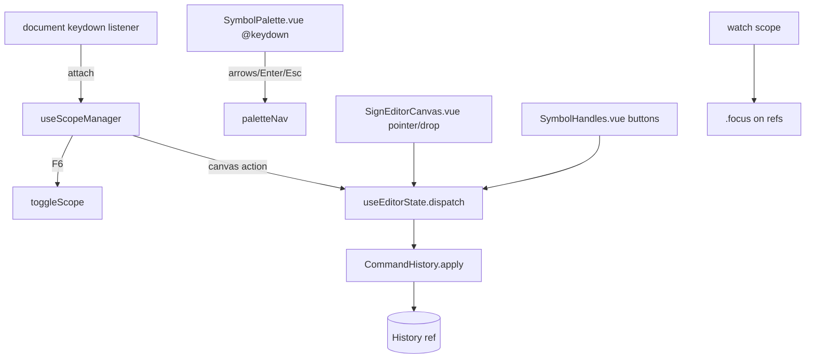
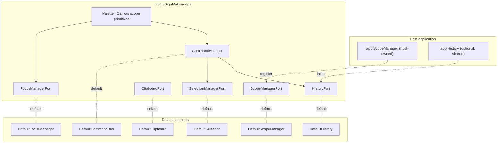
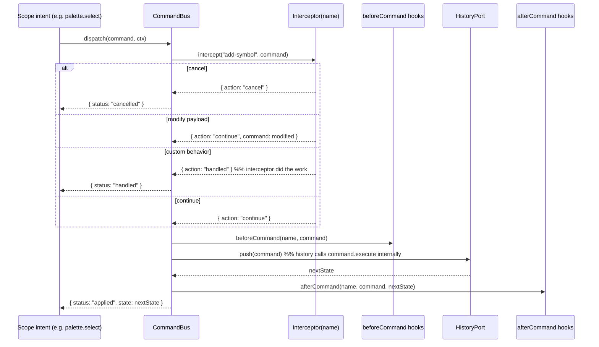
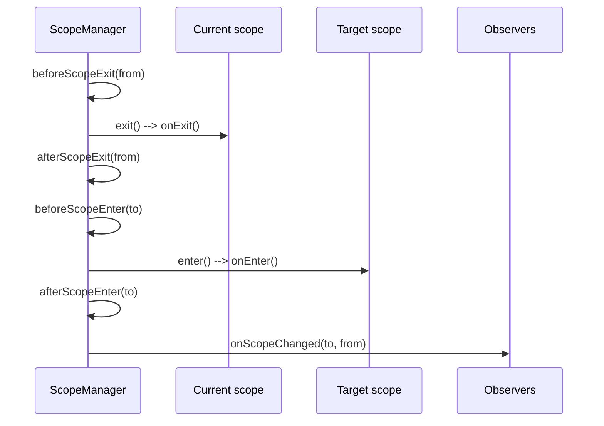
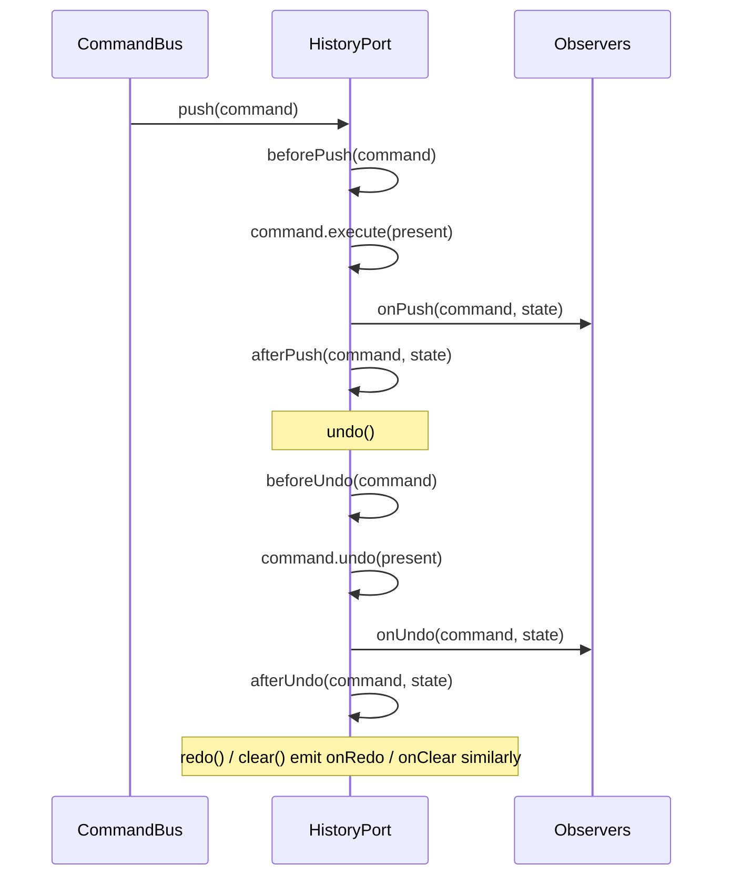

# RFC: Composable Interaction Architecture

**Status:** Accepted — Implemented
**Date:** 2026-06
**Authors:** SignMaker core team
**Supersedes nothing** — extends the decisions in [`ARCHITECTURE.md`](../../ARCHITECTURE.md)

> **Implementation note.** All seven migration phases below have shipped. The
> command bus, command-based `HistoryPort`, generic `ScopeManager`,
> `FocusManagerPort`, `createSignMaker` composition root, and the
> `createPaletteScope`/`createCanvasScope` primitives all exist in
> `@wallysonruan/signmaker-editor-engine`; the Vue layer exposes `useSignMaker`
> as the single entry point. Sections 1.x describe the **pre-migration**
> codebase and are kept for historical context. `usePaletteNavigation.ts` has
> been deleted as planned.

---

## Context

SignMaker is a Sutton SignWriting editor split into framework-agnostic core
packages (`fsw → layout → editor → renderer`) and a thin Vue layer (`vue → app`).
The core is already pure and free of singletons — a strong foundation. But the
*interaction* layer (focus, scope, keyboard, commands, history) still behaves
like a **self-contained widget** rather than a set of primitives a host
application can compose with:

- It **binds the keyboard globally to `document`** and steals focus on scope
  changes, so it cannot coexist with a host's own focus/scope system.
- Its scope model is a **hard-coded two-value toggle** (`'palette' | 'canvas'`)
  with no nesting, no enable/disable, and no observation.
- It offers **no dispatch seam** — commands are applied directly, so consumers
  cannot observe, intercept, modify, or cancel them.
- History is **snapshot-based and privately owned**, impossible to replace or
  unify with a host's history.

This RFC proposes redesigning the interaction layer as **composable primitives
and replaceable services** governed by inversion of control. SignMaker should
provide opinionated defaults but cede ownership of interaction to the consuming
application.

> **Scope of this document.** This is a *design RFC only*. It changes no
> production code. It adopts a **command-based (`execute`/`undo`)** history model
> and is free to propose **breaking changes** to current APIs (the project is
> pre-1.0). Code in this document is illustrative TypeScript, not compiled
> source.

### Guiding principles

| Prefer | Over |
|---|---|
| Composition | Inheritance |
| Inversion of control | Hidden state |
| Ports and adapters | Hard-coded ownership |
| Framework-agnostic core | Component-contained business logic |
| Thin Vue adapters | Behavior that cannot be intercepted |
| Functional primitives | Singleton managers / global state |
| Replaceable services | Forking to extend |

The recurring test for every API below: **can a consumer observe it, customize
it, extend it, or replace it entirely — without forking SignMaker?**

---

## 1. Current-State Analysis

### 1.1 Where interaction state lives today

| Concern | Owner today | Notes |
|---|---|---|
| Undo/redo history | `useEditorState()` constructs its own `History` ref — `packages/vue/src/useEditorState.ts:25` | Snapshot stack; not injectable, not observable |
| Active scope | `useScopeManager()` holds `ScopeState` ref — `packages/vue/src/useScopeManager.ts:50` | Flat `'palette' \| 'canvas'` |
| Palette navigation | `useScopeManager()` holds `paletteNav` ref (`:51`), plus a duplicated, **unused** `usePaletteNavigation.ts` | Nested palette levels live only inside palette nav state, not the scope system |
| Focus (DOM) | `App.vue` `watch(scope)` calls `.focus()` on refs — `app/src/App.vue:106-109` | Focus stealing; host cannot arbitrate |
| Keyboard listener | `attach(document)` in `App.vue:100-103` | Global; one editor per page |
| Selection | Inside `EditorState.selection: ReadonlySet<string>` — `packages/editor/src/types.ts` | Pure; mutated only via commands |
| Drag | `useSymbolDrag` + local refs in `SignEditorCanvas.vue` | Drag offset duplicated between composable and component |
| Command dispatch | `dispatch(command)` in `useEditorState.ts:31` calls `apply()` directly | **No bus, no hooks, no interception** |

### 1.2 How the pieces coordinate (current flow)



Three observations:

1. **Two keyboard owners.** Global `document` handling (canvas + F6) in
   `useScopeManager`, and a *second* handler inside `SymbolPalette.vue`
   (`~lines 241-283`). The pure router `routeKeyEvent`
   (`packages/editor/src/interaction/ScopedKeyboardRouter.ts`) already models the
   full decision table but is **not** the one actually wired in the app.
2. **Business logic in components.** `SignEditorCanvas.vue` computes FSW drop
   coordinates and dispatches `addSymbol`; `SymbolPalette.vue` runs palette
   navigation; `SymbolHandles.vue` composes rotate/mirror commands inline. These
   are interaction behaviors that should be primitives.
3. **Direct application.** `dispatch` → `apply` with nothing in between.

### 1.3 What is already clean (keep and promote to public ports)

The core is in good shape and much of it should simply be **exposed** rather than
rebuilt:

- **Pure keyboard router** — `routeKeyEvent`, `lookupAction`, `actionToCommand`
  (`packages/editor/src/interaction/ScopedKeyboardRouter.ts`,
  `packages/editor/src/KeyboardBindings.ts`). Data-driven, replaceable bindings.
  Note `undo`/`redo`/`center` return `null` from `actionToCommand` because they
  need external context (history, canvas size) — a hint that a **command bus**
  with context belongs here.
- **Pure command factories** — `addSymbol`, `moveSelected`, `rotateSelected`, …
  (`packages/editor/src/commands/symbols.ts`). Already accept an injected
  `IdGenerator`.
- **Immutable state model** — `EditorState`, `Command`
  (`packages/editor/src/types.ts`).
- **Pure selection / drag engines** — `SelectionEngine.ts`, `DragEngine.ts`.
- **Pure history transitions** — `createHistory`, `apply`, `undo`, `redo`
  (`packages/editor/src/CommandHistory.ts`).

### 1.4 Limitations that block integration

| # | Limitation | Evidence | Consequence |
|---|---|---|---|
| L1 | Keyboard bound to `document` | `App.vue:100-103` | Cannot host two editors; intercepts host shortcuts |
| L2 | Flat scope enum, no nesting/registration | `interaction/ScopeManager.ts` | Cannot model `palette-options`/`canvas-symbol`; cannot be "just another scope" |
| L3 | No enable/disable | — | Host cannot suspend SignMaker keyboard while keeping it mounted |
| L4 | No scope observation/lifecycle | — | No `currentScope()`, `onScopeChanged`, `before/afterScopeEnter/Exit` |
| L5 | No dispatch seam | `useEditorState.ts:31` | No `beforeCommand`/`afterCommand`/`intercept`; no analytics/collab/validation |
| L6 | History private & snapshot-only | `useEditorState.ts:25`, `CommandHistory.ts:11` | Not replaceable; cannot unify with host history; no `execute/undo` commands |
| L7 | Focus stealing | `App.vue:106-109` | Fights a host focus manager |
| L8 | Logic in components | `SymbolPalette.vue`, `SignEditorCanvas.vue`, `SymbolHandles.vue` | Behavior can't be reused or overridden without forking |
| L9 | Dead/duplicated path | unused `usePaletteNavigation.ts` | Drift between two nav implementations |

---

## 2. Architecture Proposal

### 2.1 Shape: ports, adapters, and a composition root

SignMaker becomes a **core of framework-agnostic primitives** behind a small set
of **ports** (interfaces). Each port has a **default adapter**. A **composition
root** `createSignMaker(deps?)` wires the defaults and lets a consumer override
any port:

```ts
const sm = createSignMaker();                 // all defaults

const sm = createSignMaker({                  // override any subset
  history:          myHistory,
  commandBus:       myBus,
  scopeManager:     myScopeManager,
  selectionManager: mySelection,
  clipboard:        myClipboard,
  focusManager:     myFocus,
});
```



### 2.2 Key design decisions

**D1 — Framework-agnostic core, thin Vue adapters.** All interaction logic
(scopes, routing, command bus, history) lives in `@signwriter/editor`. The Vue
package contributes only reactivity bridges (`useX()` composables) and
templates. No business logic in components.

**D2 — Functional factories over classes.** Matches the existing style. Every
primitive is `createX(): X` returning a closure object with methods and event
emitters. No singletons, no global state. Construction injects dependencies.

**D3 — Generic, nestable ScopeManager (replaces the enum).** A scope is a named
node that can be registered, enabled/disabled, entered/exited, and nested. The
flat `'palette' | 'canvas'` becomes a tree:

```
signmaker
├── palette
│   └── palette-options      (variant tabs / expanded group)
└── canvas
    └── canvas-symbol        (a selected symbol's navigation)
```

Crucially, **SignMaker registers its scopes into a manager it can receive from
the host**. If the host passes its own `ScopeManager`, SignMaker becomes "just
another scope" in the host's tree:

```
app
├── sidebar
├── toolbar
├── signmaker        ← createSignMaker({ scopeManager: appScope })
│   ├── palette
│   └── canvas
└── footer
```

A disabled scope ignores keyboard input and yields focus ownership to its parent.

**D4 — Command-based history (`execute`/`undo`).** Today's one-way
`(state) => state` factories are migrated to first-class command *objects* that
carry both directions and a stable `name`:

```ts
interface Command<S = EditorState> {
  readonly name: string;              // "add-symbol", "move-symbol", …
  readonly payload?: unknown;         // inspectable/modifiable by interceptors
  execute(state: S): S;
  undo(state: S): S;
}
```

This enables (a) a history that stores *commands* rather than full snapshots,
(b) **shared application history** (a host can push SignMaker commands onto its
own stack alongside form/document commands), and (c) named interception. The
existing pure transforms in `commands/symbols.ts` become the `execute` bodies;
each gains an inverse (`undo`). Where an inverse is awkward to derive, the
command may capture the pre-image at execute time (memento-per-command) — still
far lighter than whole-state snapshots and still uniform under one interface.

**D5 — Command bus as the single dispatch seam.** All commands flow through one
bus that carries the lifecycle and interception. This is the seam that L5 is
missing:

```ts
interface CommandBus {
  dispatch(command: Command, ctx?: CommandContext): CommandResult;
  beforeCommand(name: string | '*', fn: BeforeHook): Unsubscribe;
  afterCommand(name: string | '*', fn: AfterHook): Unsubscribe;
  intercept(name: string, handler: Interceptor): Unsubscribe;
}
```

An interceptor may **continue**, **modify the payload**, **cancel**, or **run
custom behavior** — see §4.1.

**D6 — Smallest abstraction per concern.** Don't over-build. The chosen
abstraction per concern (with rationale in §3.4): scopes are tiny
controllers/state machines; observation is event emitters; dispatch is the
command bus; replacement is ports. No general-purpose plugin framework, no DI
container — just functions and interfaces.

---

## 3. Public API Proposal

These are the **stable extension points**. The design favors a handful of
`create*` factories plus uniform `on*`/`before*`/`after*`/`intercept` hooks.

### 3.1 Composition root

```ts
function createSignMaker(deps?: Partial<SignMakerPorts>): SignMaker;

interface SignMakerPorts {
  history:          HistoryPort;
  commandBus:       CommandBusPort;
  scopeManager:     ScopeManagerPort;
  selectionManager: SelectionManagerPort;
  clipboard:        ClipboardPort;
  focusManager:     FocusManagerPort;
  idGenerator:      IdGenerator;          // already a core concept
}

interface SignMaker {
  readonly palette: PaletteScope;
  readonly canvas:  CanvasScope;
  readonly scope:   ScopeManagerPort;     // the (possibly host-owned) manager
  readonly bus:     CommandBusPort;
  readonly history: HistoryPort;
  enable(): void;                         // enable signmaker's whole subtree
  disable(): void;
  getState(): EditorState;
  dispose(): void;
}
```

### 3.2 Scope primitives

```ts
function createScopeManager(opts?: ScopeManagerOptions): ScopeManagerPort;
function createPaletteScope(deps: ScopeDeps): PaletteScope;
function createCanvasScope(deps: ScopeDeps):  CanvasScope;
function createSignMakerScope(deps: ScopeDeps): Scope; // parent of palette+canvas
```

Every scope shares a common surface:

```ts
interface Scope {
  readonly name: string;                 // "palette", "canvas-symbol", …
  enter(): void;
  exit(): void;
  enable(): void;
  disable(): void;
  isEnabled(): boolean;
  current(): string | null;              // active descendant, if any

  onEnter(fn: () => void): Unsubscribe;
  onExit(fn: () => void): Unsubscribe;

  // command lifecycle scoped to this subtree
  beforeCommand(name: string | '*', fn: BeforeHook): Unsubscribe;
  afterCommand(name: string | '*', fn: AfterHook): Unsubscribe;
  intercept(name: string, handler: Interceptor): Unsubscribe;

  handleKey(e: KeyEventDescriptor): boolean; // returns true if consumed
}
```

Domain scopes add intent methods (thin, named wrappers over command dispatch):

```ts
interface PaletteScope extends Scope {
  next(): void; previous(): void;        // grid navigation
  expand(): void;                         // enter palette-options
  select(): void;                         // add focused symbol
  readonly nav: PaletteNavigationState;   // observable
}

interface CanvasScope extends Scope {
  next(): void; previous(): void;        // cycle selection
  move(dx: number, dy: number): void;
  delete(): void;
}
```

Because these are plain functions, a consumer composes without forking:

```ts
function customSelect() {
  analytics.track('palette.select', { key: palette.nav.focusedKey });
  palette.select();
}
```

### 3.3 Scope manager

```ts
interface ScopeManagerPort {
  register(scope: Scope, parent?: string): void;
  unregister(name: string): void;

  enable(name: string): void;
  disable(name: string): void;

  enter(name: string): void;
  exit(name: string): void;
  currentScope(): string | null;        // e.g. "palette-options"

  onScopeChanged(fn: (to: string | null, from: string | null) => void): Unsubscribe;

  beforeScopeEnter(fn: ScopeHook): Unsubscribe;
  afterScopeEnter(fn: ScopeHook): Unsubscribe;
  beforeScopeExit(fn: ScopeHook): Unsubscribe;
  afterScopeExit(fn: ScopeHook): Unsubscribe;

  routeKey(e: KeyEventDescriptor): boolean; // dispatch to current scope subtree
}
```

### 3.4 Defaults

```ts
function createDefaultHistory(opts?): HistoryPort;
function createDefaultCommandBus(opts?): CommandBusPort;
function createDefaultScopeManager(opts?): ScopeManagerPort;
function createDefaultSelectionManager(state): SelectionManagerPort;
function createDefaultClipboard(): ClipboardPort;
function createDefaultFocusManager(): FocusManagerPort;
```

### 3.5 Abstraction choices (avoid over-building)

| Concern | Abstraction | Why this and not more |
|---|---|---|
| Scope lifecycle & nesting | Small controller + state machine | A tree of enter/exit states is exactly a hierarchical state machine; nothing heavier needed |
| Observation (scope/command/history) | Event emitters (`on*`) | Cheap, framework-neutral, trivially adapted to Vue refs |
| Dispatch + interception | Command bus | One choke point gives before/after/intercept uniformly |
| Replacement | Ports + default adapters | Lets any service be swapped independently without a DI container |
| Undo/redo | Command objects + HistoryPort | `execute`/`undo` enables shared host history |
| Keyboard | Pure router (`routeKeyEvent`) already present | Reuse; just feed it from scoped elements |

---

## 4. Event and Command Lifecycles

### 4.1 Command dispatch



`beforeCommand`/`afterCommand` are the seams for **analytics, telemetry, sound
effects, collaboration, and validation** (validation can also cancel from an
interceptor).

### 4.2 Scope transition



Any `before*` hook may veto the transition (return `false`), letting a host keep
ownership (e.g. refuse to leave a dirty form field).

### 4.3 History



---

## 5. Replaceable Service Architecture (Ports & Default Adapters)

Each port is independently replaceable; defaults wrap today's pure engines.

### 5.1 HistoryPort

```ts
interface HistoryPort {
  push(command: Command): EditorState;
  undo(): EditorState;
  redo(): EditorState;
  clear(): void;
  canUndo(): boolean;
  canRedo(): boolean;
  present(): EditorState;

  onPush(fn: HistoryHook): Unsubscribe;
  onUndo(fn: HistoryHook): Unsubscribe;
  onRedo(fn: HistoryHook): Unsubscribe;
  onClear(fn: () => void): Unsubscribe;
  beforePush(fn: HistoryHook): Unsubscribe;
  afterPush(fn: HistoryHook): Unsubscribe;
  beforeUndo(fn: HistoryHook): Unsubscribe;
  afterUndo(fn: HistoryHook): Unsubscribe;
}
```

**DefaultHistory** evolves `packages/editor/src/CommandHistory.ts` from a snapshot
stack into a **command stack** (stores `Command` objects; `undo()` calls
`command.undo`). The pure functions (`apply`, `undo`, `redo`) remain the
implementation core, wrapped by the port to add hooks. A consumer can inject a
host history so SignMaker commands share the application's stack (§8.6).

### 5.2 CommandBusPort

```ts
interface CommandBusPort {
  dispatch(command: Command, ctx?: CommandContext): CommandResult;
  beforeCommand(name: string | '*', fn: BeforeHook): Unsubscribe;
  afterCommand(name: string | '*', fn: AfterHook): Unsubscribe;
  intercept(name: string, handler: Interceptor): Unsubscribe;
}
type Interceptor = (cmd: Command, ctx: CommandContext) =>
  | { action: 'continue'; command?: Command }
  | { action: 'cancel' }
  | { action: 'handled' };
```

**DefaultCommandBus** routes a command through interceptors and before/after
hooks, then `history.push`. `CommandContext` carries the external context that
`actionToCommand` currently can't supply for `undo`/`redo`/`center` (history
handle, canvas size, id generator).

### 5.3 ScopeManagerPort

Interface in §3.3. **DefaultScopeManager** is a hierarchical state machine built
on the existing pure router `routeKeyEvent`
(`packages/editor/src/interaction/ScopedKeyboardRouter.ts`); the flat
`ScopeManager.ts` enum is generalized into named, nestable nodes.

### 5.4 SelectionManagerPort

```ts
interface SelectionManagerPort {
  selected(state: EditorState): EditorSymbol[];
  selectById(state: EditorState, id: string): EditorState;
  selectNone(state: EditorState): EditorState;
  cycle(state: EditorState, step: number): EditorState;
  onSelectionChanged(fn: (ids: ReadonlySet<string>) => void): Unsubscribe;
}
```

**DefaultSelection** wraps `packages/editor/src/SelectionEngine.ts` verbatim and
emits change events when commands alter `state.selection`.

### 5.5 ClipboardPort

```ts
interface ClipboardPort {
  copy(symbols: EditorSymbol[]): void;
  paste(): EditorSymbol[];
  hasContent(): boolean;
}
```

**DefaultClipboard** is in-memory and built on `copySelected`
(`commands/symbols.ts`). A host may swap in a system-clipboard adapter.

### 5.6 FocusManagerPort

```ts
interface FocusManagerPort {
  request(target: FocusTarget): void;   // SignMaker asks; host may honor/deny
  release(): void;
  onFocusChanged(fn: (target: FocusTarget | null) => void): Unsubscribe;
}
```

**DefaultFocusManager** reproduces today's behavior (focus the palette/canvas
element). Replacing it removes the focus-stealing problem (L7): the host arbitrates
focus and SignMaker merely *requests* it.

---

## 6. Vue Proof of Concept

Goal: components become **thin adapters** that bind a core scope's reactive state
and forward DOM events; no interaction logic in templates.

### 6.1 Thin composables

```ts
// packages/vue/src/usePaletteScope.ts  (thin adapter)
export function usePaletteScope(sm: SignMaker) {
  const nav = shallowRef(sm.palette.nav);
  sm.palette.onEnter(() => focusEl());
  // mirror core observable into a ref
  sm.bus.afterCommand('*', () => { nav.value = sm.palette.nav; });

  const el = ref<HTMLElement | null>(null);
  function onKeydown(e: KeyboardEvent) {
    if (sm.palette.handleKey(toDescriptor(e))) e.preventDefault();
  }
  return { nav, el, onKeydown, select: sm.palette.select, expand: sm.palette.expand };
}
```

### 6.2 Keyboard scoped to an element, focus delegated

**Before** (`app/src/App.vue:100-109`):

```ts
onMounted(() => { const detach = attach(document); onUnmounted(detach); });
watch(scope, (s) => (s === 'palette' ? paletteRef.value?.focus()
                                     : canvasRef.value?.focus()));
```

**After** — keyboard binds to the SignMaker root element, focus goes through the
port:

```ts
const sm = createSignMaker();                 // or pass host ports
onMounted(() => {
  const root = rootEl.value!;
  const handler = (e: KeyboardEvent) => { if (sm.scope.routeKey(toDescriptor(e))) e.preventDefault(); };
  root.addEventListener('keydown', handler);  // scoped, not document
  onUnmounted(() => root.removeEventListener('keydown', handler));
});
// no watch(scope) focus stealing — DefaultFocusManager (or the host) handles it
```

### 6.3 Component shrinkage

| Component | Today | After |
|---|---|---|
| `SymbolPalette.vue` | own `@keydown` block (arrows/Enter/Esc), nav logic | render `nav`; forward keys to `sm.palette.handleKey` |
| `SignEditorCanvas.vue` | pointer math + FSW drop coords + dispatch | forward pointer events to `useCanvasScope`; canvas scope owns drop→command |
| `SymbolHandles.vue` | composes rotate/mirror commands inline | call `sm.canvas.rotate()` / `.mirror()` intents |
| `App.vue` | `useEditorState` + `useScopeManager` + focus watch | `createSignMaker()` + thin `useX` bindings |

The dead `usePaletteNavigation.ts` is deleted (L9).

---

## 7. Migration Plan

Incremental phases, each independently shippable and keeping `make ci` green.
Commit scopes per [`AGENTS.md`](../../AGENTS.md): `editor`, `vue`, `app`, `docs`.
**All phases are complete** — status noted per phase.

1. ✅ **Command bus behind existing dispatch** (`editor`, `vue`). Added
   `createCommandBus` (`CommandBus.ts`); routed `useEditorState.dispatch` through
   it. `beforeCommand`/`afterCommand`/`intercept` available.
2. ✅ **Generalize ScopeManager** (`editor`, `vue`). Replaced the flat enum with
   registerable named scopes (`createScopeManager.ts`); adapted `useScopeManager`.
   Added `currentScope`, `onScopeChanged`, lifecycle hooks, enable/disable.
3. ✅ **Scope the keyboard + FocusManagerPort** (`vue`, `app`). Listener moved
   off `document` to the SignMaker root element; focus routed through
   `createFocusManager`; `watch(scope)` focus stealing removed.
4. ✅ **Command-based history** (`editor`). Introduced `ReversibleCommand` and
   `createMementoCommand`; `createDefaultHistory` implements `HistoryPort` with
   lifecycle hooks. The bus `apply` threads the command name into named history
   entries. (The snapshot `CommandHistory` is retained for the standalone path
   rather than removed.)
5. ✅ **Composition root** (`editor`, `vue`, `app`). Added `createSignMaker(deps?)`
   and the `useSignMaker` Vue umbrella; `App.vue` consumes it; all ports are
   overridable.
6. ✅ **Extract scope primitives & thin components** (`editor`, `vue`). Shipped
   `createCanvasScope`/`createPaletteScope` (+ `usePaletteScope`); reduced
   `SymbolPalette` to a thin adapter; deleted `usePaletteNavigation.ts`.

Each phase had a clear rollback point because ports keep old and new wiring
behind a stable surface.

> Two deviations from the original plan, both deliberate: the legacy snapshot
> `CommandHistory` was **kept** (not removed) so the standalone path stays
> available, and `SelectionManagerPort`/`ClipboardPort` (§5.4–5.5) remain
> design-only — selection still lives inside `EditorState` and no clipboard
> port was needed yet. Both are additive future work, not blockers.

---

## 8. Examples

### 8.1 Application-wide scope management

```ts
const appScope = createScopeManager();
appScope.register(sidebarScope);
appScope.register(toolbarScope);

const sm = createSignMaker({ scopeManager: appScope }); // registers palette+canvas
appScope.register(footerScope);

appScope.currentScope(); // "canvas"
```

### 8.2 Enable/disable palette and canvas

```ts
sm.palette.disable();    // palette ignores keys; focus stays with host
sm.canvas.enable();

sm.disable();            // suspend the whole SignMaker subtree
sm.enable();
```

### 8.3 Observe transitions

```ts
appScope.onScopeChanged((to, from) => {
  statusBar.show(`scope: ${from ?? '∅'} → ${to ?? '∅'}`);
});
```

### 8.4 Command interception

```ts
sm.bus.intercept('add-symbol', (cmd, ctx) => {
  if (atSymbolLimit()) { toast('Limit reached'); return { action: 'cancel' }; }
  if (shouldSnap(cmd)) return { action: 'continue', command: snapToGrid(cmd) };
  return { action: 'continue' };
});
```

### 8.5 Analytics / telemetry / sound

```ts
sm.bus.beforeCommand('*', (cmd) => analytics.track(`cmd:${cmd.name}`, cmd.payload));
sm.bus.afterCommand('add-symbol', () => sfx.play('place'));
appScope.afterScopeEnter((name) => telemetry.mark(`scope:${name}`));
```

### 8.6 Undo/redo and shared application history

```ts
// SignMaker pushes its commands onto the host's stack:
const appHistory = createAppHistory(); // form + document + signmaker commands
const sm = createSignMaker({ history: adaptToHistoryPort(appHistory) });

appHistory.undo(); // naturally undoes the last SignMaker command too
```

```
Application History
├── Form Changes
├── Document Operations
├── SignMaker Commands   ← interleaved via the shared HistoryPort
└── Metadata Changes
```

### 8.7 Custom command bus (collaboration / event sourcing)

```ts
const collabBus: CommandBusPort = {
  dispatch(cmd, ctx) {
    crdt.broadcast(serialize(cmd));      // event sourcing / distributed
    return defaultBus.dispatch(cmd, ctx);
  },
  beforeCommand: defaultBus.beforeCommand,
  afterCommand:  defaultBus.afterCommand,
  intercept:     defaultBus.intercept,
};
const sm = createSignMaker({ commandBus: collabBus });
```

### 8.8 Complete replacement from primitives

Rebuild SignMaker's behavior externally — own scope manager, history, bus, and
hooks — without touching SignMaker internals:

```ts
import {
  createPaletteScope, createCanvasScope, createScopeManager,
  createDefaultCommandBus, EMPTY_STATE,
} from '@signwriter/editor';

const history = myCustomHistory();           // HistoryPort
const bus     = createDefaultCommandBus({ history });
bus.beforeCommand('*', analytics.track);
bus.afterCommand('*', (c, s) => collab.publish(c, s));

const scopes  = createScopeManager();
const palette = createPaletteScope({ bus, history });
const canvas  = createCanvasScope({ bus, history });
scopes.register(palette);
scopes.register(canvas);

// application-wide focus + undo/redo wired to the host
focusManager.onFocusChanged((t) => scopes.enter(t?.scope ?? 'canvas'));
hostUndoButton.onClick(() => history.undo());
```

Same building blocks, fully consumer-owned composition.

---

## Goal restated

The result lets a consumer use everything via `createSignMaker()` or override any
piece via `createSignMaker({ history, commandBus, scopeManager, selectionManager,
clipboard, focusManager })` — observing, customizing, extending, or replacing
internal behavior without forking. SignMaker provides opinions and defaults;
**ownership of interaction belongs to the consuming application.**
